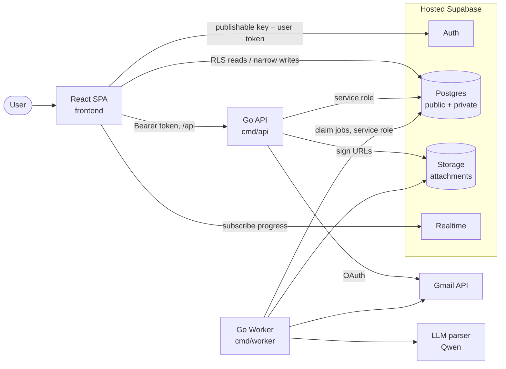
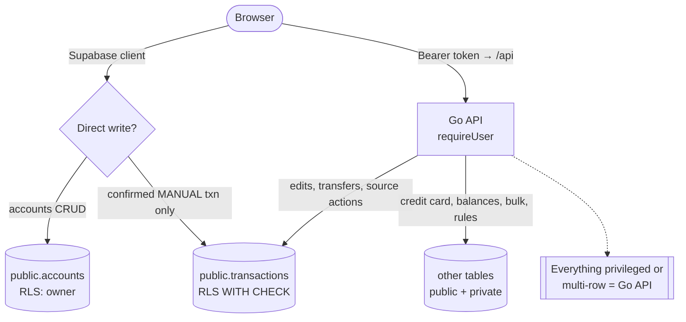
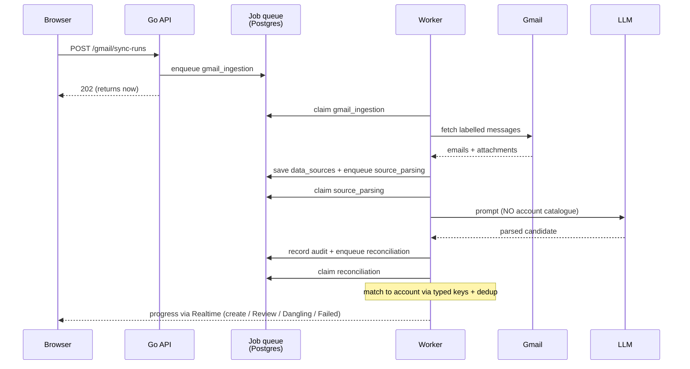
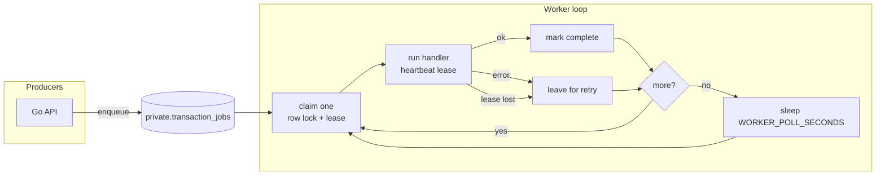
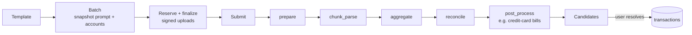
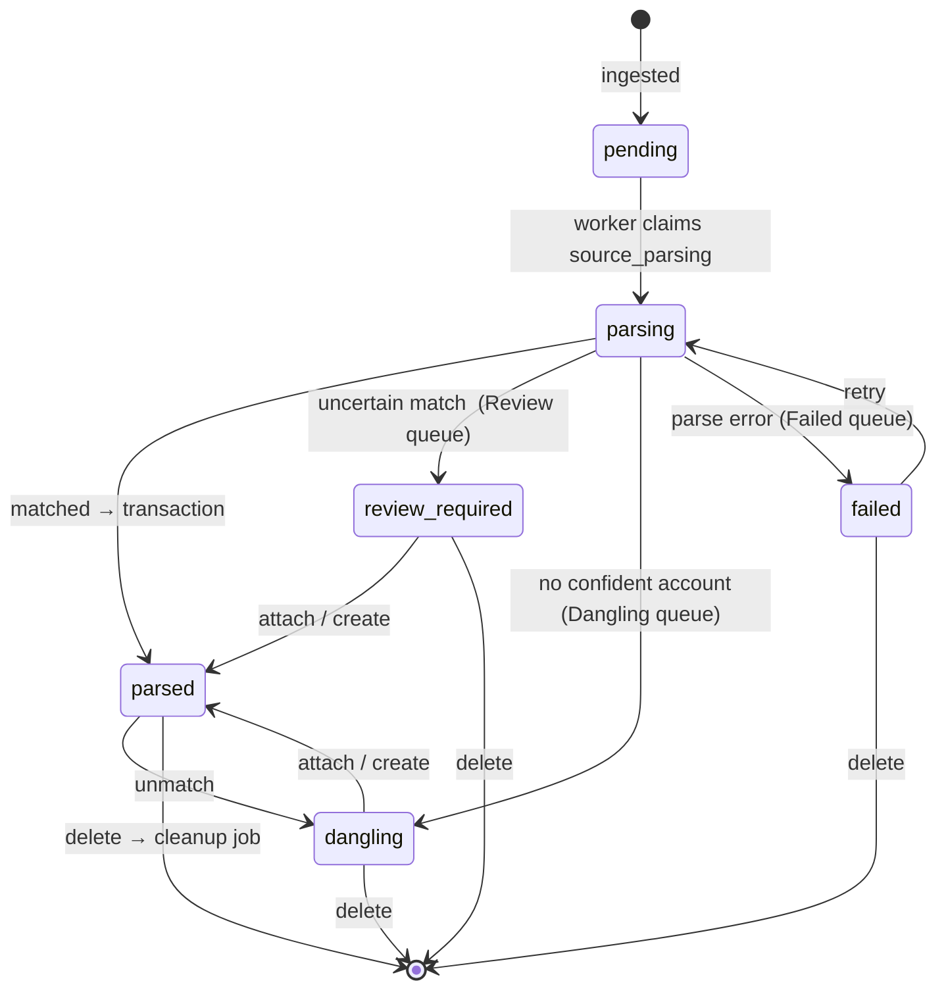
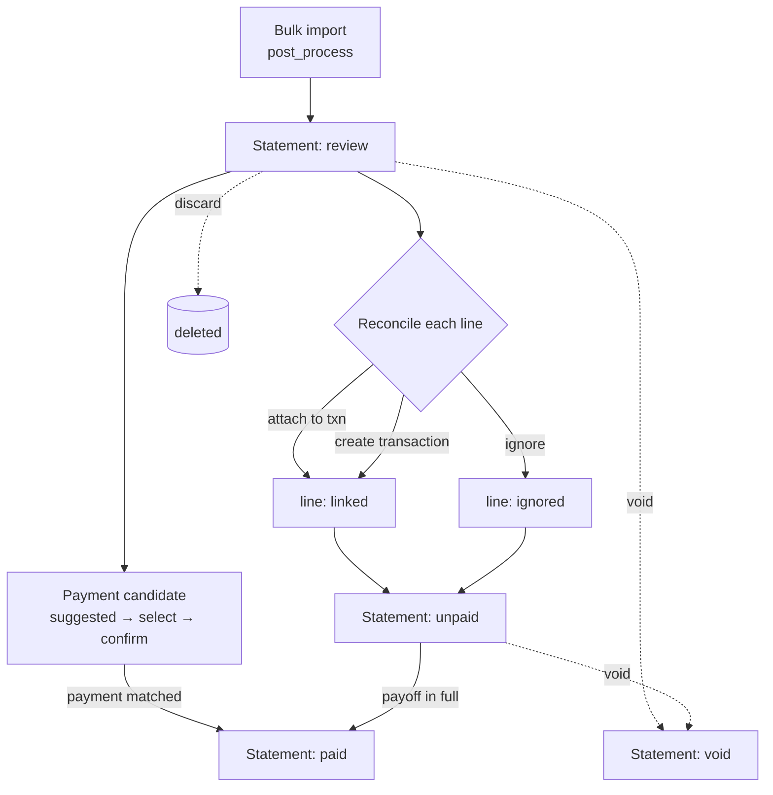

# Data Flow Diagrams

Small, focused diagrams. Each one answers a single question. Start at #1 for the big
picture, then drill into the pipeline you care about.

---

## 1. Components — who talks to whom

---

## 2. The two write paths

The browser writes **directly** to Supabase only for a tiny, RLS-guarded set;
everything else goes through the Go API.

---

## 3. Gmail → transaction pipeline

The core flow. The HTTP request returns immediately; the worker does the slow work.

---

## 4. Durable job queue — how async work runs

No broker. Jobs live in Postgres; the worker claims them with a lease.

---

## 5. Bulk Import pipeline (flag-gated)

Uploaded documents flow into the **same** evidence model as Gmail
(`data_sources`), through a 5-stage job chain.

---

## 6. Source lifecycle & the three queues

What happens to a piece of evidence (`data_sources.parse_status`), and how the
Review / Dangling / Failed queues arise. User actions come through the Go API.

---

## 7. Credit-card bill reconciliation

A bill (`credit_card_statements.status`) generated from a bulk import, its line
resolution, and payment detection. Lines are `pending → linked | ignored`; a
payment candidate is `suggested → selected → confirmed`.

---

### Legend

- **RLS** = row-level security (owner-scoped, `auth.uid() = user_id`).
- **Job kinds** (queue): `gmail_ingestion`, `source_parsing`, `reconciliation`,
  `source_attachment_cleanup`, and the five `bulk_*` kinds.
- Diagram source: edit the Mermaid blocks above. See
  [02 — Architecture](02-architecture.md) for the narrative version.
